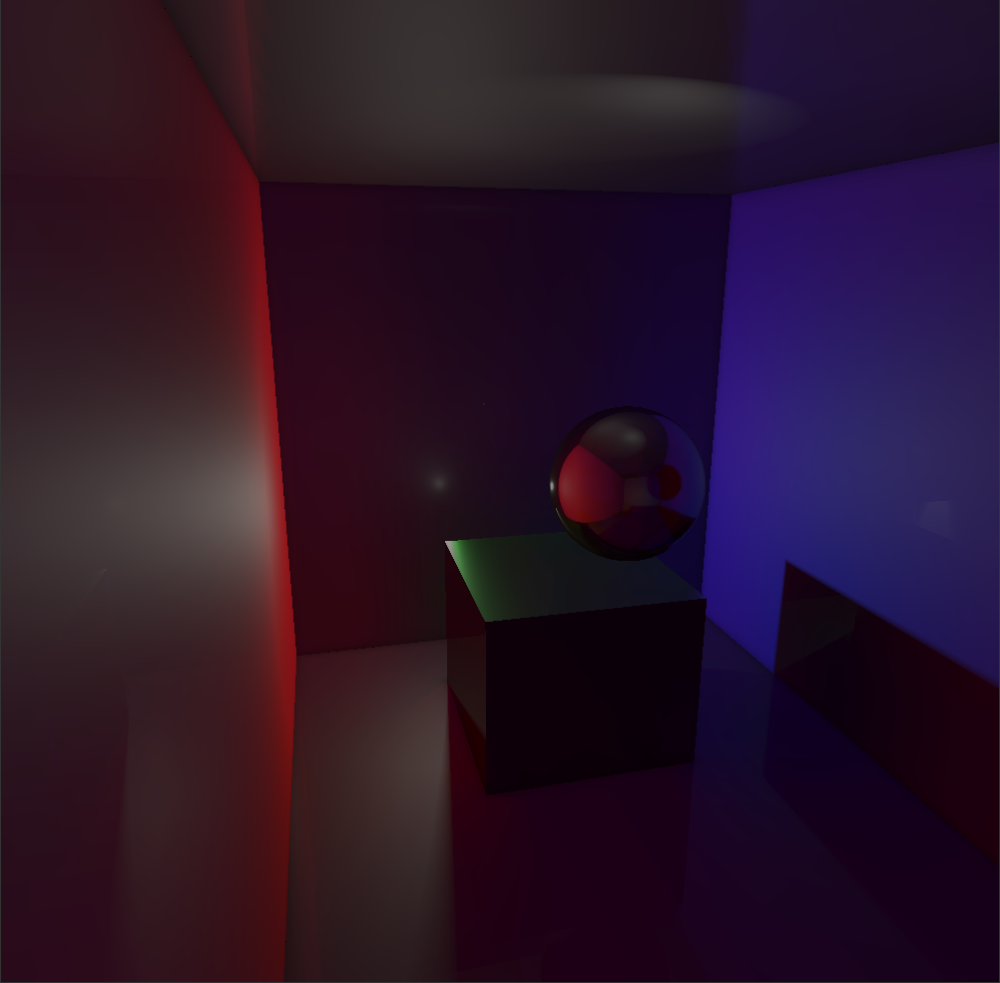

# Madarch
Ray marching engine in Ada and GLSL.

## Features

- Real-time global illumination, based on the <a href=http://jcgt.org/published/0008/02/01/paper-lowres.pdf>DDGI</a> paper.
- Physically-based materials.
- Soft shadows.
- World-space reflections.
- Glossy reflections (*WIP*).
- World-space ambient occlusion.
- Arbitrary meshes (voxelization, *WIP*).
- Space partitioning (3D grid).
- Volumetric lighting (light shafts).

## Illustrations

   
  <i>Figure 1</i>

   
  <i>Figure 2</i>

- *Figure 1* showcases real-time global illumination: when the spot light targets the blue wall, only blue light bounces off it and propagate in the room, meaning everything appears blue. Similarly, in turns red as soon as the spot hits the red wall.

- *Figure 2* showcases world-space reflections (on the sphere), ambient occlusion, soft shadows and physically-based materials.
