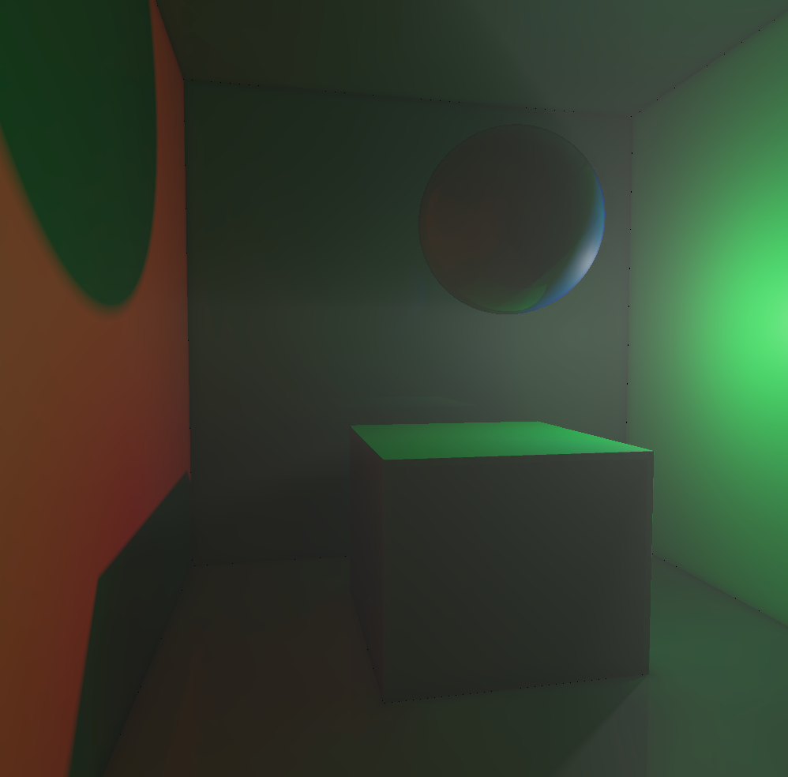

# Madarch
Ray marching engine in Ada and GLSL.

## Features

- Real-time global illumination, based on the <a href=http://jcgt.org/published/0008/02/01/paper-lowres.pdf>DDGI</a> paper.
- Physically-based materials.
- Soft shadows.
- World-space reflections.
- Glossy reflections (*WIP*).
- World-space ambient occlusion.
- Arbitrary meshes (voxelization, *WIP*).
- Space partitioning (3D grid).
- Volumetric lighting (light shafts).

## Build library

The project uses [Alire](https://alire.ada.dev/) to manage its dependencies, but is not published there yet. So, simply clone this repository and run `alr build` to build the Madarch library.

## Try the examples

In order to build and run the examples:

- Build the Madarch library as described above.
- Run `eval $(alr printenv)` to make it available in the current shell.
- To build the `global_illumination` example, run `gprbuild -P examples/global_illumination/gi.gpr`.
- Run it with `./examples/global_illumination/bin/main`. *Note that for now you **must** run it from Madarch's root directory*

The other examples follow a similar structure.

## Illustrations

   
  <i>Figure 1</i>

   
  <i>Figure 2</i>

   
  <i>Figure 3</i>

- *Figure 1* showcases real-time global illumination: when the spot light targets the blue wall, only blue light bounces off it and propagates in the room, meaning everything appears blue. Similarly, in turns red as soon as the spot hits the red wall.

- *Figure 2* showcases world-space reflections (on the sphere), ambient occlusion, soft shadows and physically-based materials.

- *Figure 3* showcases volumetric lighting: the point light is on the right of the sphere, so air particles on the left of lie in it its shadow, which creates a shadow volume.
